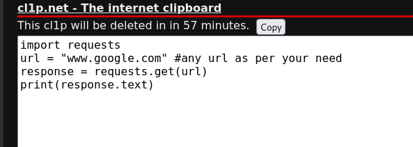
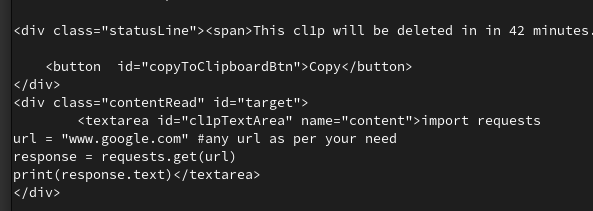

# Trick 1: Retrieving Data with Curl
*Retrieve or Download data from a website without using Browser*

**Objective:** Use `curl` to retrieve data from a site without using any browser.

### Command:
```bash
curl --output filename.ext --url https://yoururl.com
```
This command downloads the metadata and data from the specified URL (`https://yoururl.com`), saving it as `filename.ext`.

--- 
### Exercise 1:
Imagine you are in a private computer laboratory with restricted browser usage, but you have an internet connection.

**Scenario**: You need a source code to implement a function, but you don't know the function.

**Solution**: Cleverly use curl to retrieve data from the site where the code is located.

1. Change to the directory you want to download the retrived data.

```bash
cd yourdirectory
```
2. This command downloads the HTML page code from `https://cl1p.net/eth` and saves it as `code.html`.

```bash
curl --output code.html --url https:cl1p.net/eth
```

*I've already made a clipboard with my code inside. Just so you know, you can make a clipboard with any web address you like. This makes it easy to keep and share your code whenever you need*



> **Important Tip**: *use [cl1p.net](https://cl1p.net) to create an online clipboard to store your code temporarily*
--- 
### Exercise 2:
You find yourself in a restricted environment, the same as Exercise 1. However, this time, you face an additional challenge — you're unable to download any files directly from the site.

**Scenario**: You require a specific code snippet for a project, but you're in a computer lab where downloading files is restricted. Despite the limitations, you have internet access.

**Solution**: Use `curl` to fetch the code directly from the website and view it right in the terminal. No need to download a file; you can check and use the code directly.

```bash
curl https://yoururl.com/codeSnippet

```
Resulting in a terminal output rather than a downloaded file.


---
### Exercise 3:

**Situation**: The environment is now even more restricted, with monitoring on everyone's PC. Downloading files or running certain commands might be closely watched.

**Scenario**: Despite the increased surveillance, you still need a specific code snippet for your project. You're in the same computer lab with restricted downloads, but now there's active monitoring.

**Solution**: Given the heightened surveillance and restrictions, using Python to retrieve the code can be a discreet way to obtain it without triggering suspicion.

1. Create a python script
```python
import requests
url = "www.google.com" #any url as per your need
response = requests.get(url)
print(response.text)
```
2. Run the python script

    - Save the Python script in a file [retrieve_data.py](./retrieve_data.py)
    - Execute the script in the terminal using
    ```bash
    python retrieve_data.py 
    ```
    - The code content will be displayed in the terminal without leaving a trace of a downloaded file.

> Note: Always use such methods responsibly and ensure they comply with ethical guidelines and local regulations. Respect the policies and rules of the environment you are in.
